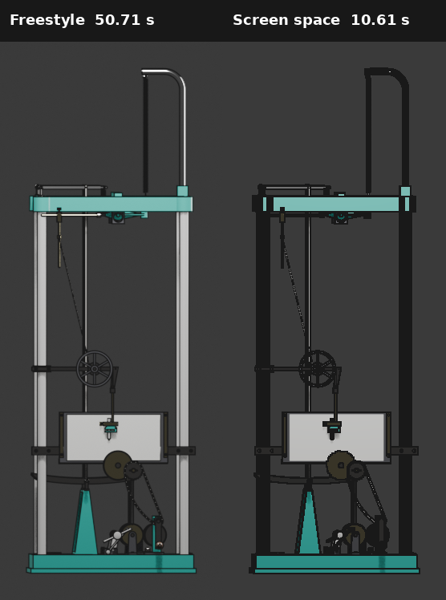
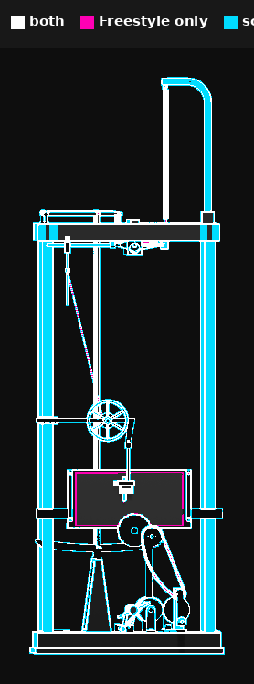
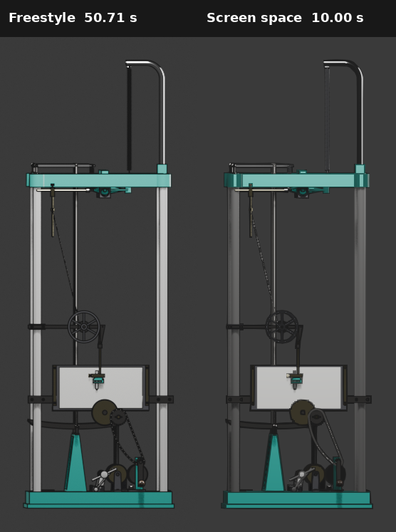

# Issue 63 screen-space edge experiment

This compares MeshProbe's Freestyle `shaded_edges` render with an experimental GPU
compositor pass on the 409-component harmonic-analyzer GLTF. Both images use the same
1024x1024 camera, scene hash, lighting, and 64 EEVEE samples.

| Render | Wall time |
| --- | ---: |
| Plain `shaded` | 5.16 s |
| Freestyle `shaded_edges` | 50.71 s |
| Opaque experimental `screen_edges` | 10.61 s |
| 85% edge-opacity mitigation | 10.00 s |

The mitigated screen pass is 5.07 times faster than Freestyle in this run. It applies Sobel filters to
the depth and normal passes in Blender's GPU compositor, thresholds both results, and overlays
the combined mask on the shaded image.

The screen pass catches most of the prominent boundaries, but its lines are heavier. Narrow
posts, curved tubing, and the dense lower mechanism can become nearly solid black because an
edge occupies a large fraction of their projected width.

This overlay compares pixels changed from the plain shaded render by at least 24 in one sRGB
channel. White pixels changed in both edge renders, magenta pixels changed only under
Freestyle, and cyan pixels changed only under the screen pass.

| Coverage metric | Pixels |
| --- | ---: |
| Shared | 14,409 |
| Freestyle only | 561 |
| Screen only | 16,474 |
| Freestyle total | 14,970 |
| Screen-space total | 30,883 |

At this threshold, the screen pass overlaps 96.25% of Freestyle's changed pixels but draws
more than twice as many changed pixels overall. Its intersection-over-union with Freestyle is
45.82%. This is a coverage comparison, not a claim that overlapping pixels have the same
geometric meaning.

The prototype uses fixed normalized-depth and normal thresholds of 0.01 and 0.3. Tuning them
can trade missed edges for heavier lines, but cannot make a screen-space discontinuity test
equivalent to Freestyle's topology and visibility classifications.

## Thin-feature mitigation

The first pass replaced every detected pixel with the line color. Because Sobel marks a band
around a discontinuity, the bands from opposite sides overlap on narrow parts and make them
look solid black. Background and broad-surface pixels were not darker; the mask covered most
of the visible pixels on the thin parts.

The selected mitigation antialiases the binary mask, then scales it to 85% before using it as
the Mix factor. Detection positions stay unchanged, but coverage is smoother and enough of the
underlying shaded color remains visible:

This is a useful compromise, not semantic parity. The screen-space lines are softer than
Freestyle, and false-positive detections remain present even though they are less dominant. A
50% blend preserved more shading but looked noticeably soft; 65% and 75% were intermediate.
The 85% result recovered 93.66% of Freestyle's changed pixels at the report threshold while
preserving the narrow-part highlights that the opaque pass erased.

A one-pixel erosion was also tested and rejected: it removed isolated one-pixel contours,
reduced overlap with Freestyle from 96.25% to 46.41%, and left broken or asymmetric outlines.

## Blender documentation check

The implementation and mitigation follow Blender's documented compositor behavior:

- The compositor [can run on the GPU](https://docs.blender.org/manual/en/latest/compositing/sidebar.html#performance).
- The Mix node's [Factor controls interpolation between its A and B inputs](https://docs.blender.org/manual/en/5.0/compositing/types/color/mix/mix_color.html).
- Negative Dilate/Erode size [shrinks the mask](https://docs.blender.org/manual/en/4.5/compositing/types/filter/dilate_erode.html), and Step mode uses the minimum value in a square neighborhood for erosion. This matches the observed loss of thin contours.
- Blender's [Anti-Aliasing node](https://docs.blender.org/manual/en/5.0/compositing/types/filter/anti_aliasing.html) smooths the binary mask's jagged edges. It does not change which pixels the depth/normal test classifies, so the opacity blend is still needed to keep overlapping bands from blacking out a thin part.

`tools/compare_edge_renders.py` regenerates the paired views, overlay, and `metrics.json` from
the three source renders.
